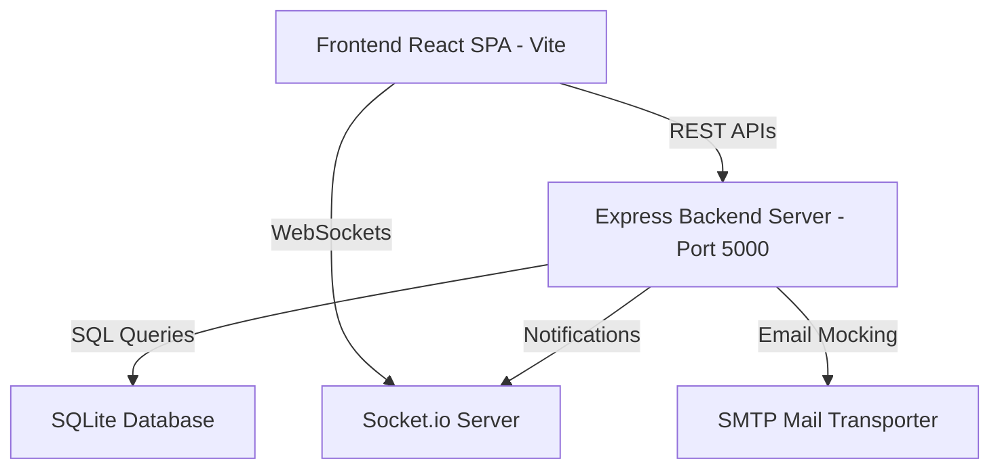

# 📘 Syncra Enterprise: System Manual & Documentation

Welcome to the comprehensive documentation suite for **Syncra Enterprise**—a secure, decentralized, and AI-assisted Workforce Management Platform (WFM) with an Agentic Operations Assistant.

This document serves as the master guide for developers, system architects, and operators.

---

## 🏛️ System Architecture

Syncra Enterprise is built as a lightweight, fast, and high-performance full-stack application.



### 1. Frontend Client
* **Framework:** React 19 (compiled with Vite)
* **Design System:** Custom CSS featuring an Indigo-Glassmorphic theme with a dark/light mode toggle.
* **Animations:** Canvas-based interactive physics grids (Concentric vector dots with squishy drag inertia).
* **Iconography:** Lucide-React vector graphics.
* **State Management:** Local React state, reference hooks, and persistent context stores.

### 2. Backend Server
* **Framework:** Node.js with Express
* **Database:** SQLite (Relational, SQL-based storage running in file mode)
* **Real-time Comms:** Socket.io (for push notifications, activities, and terminal events)
* **Security:** JWT authentication middleware, cryptographically secure password hashing, and role-based access control (RBAC).
* **Mailing:** Nodemailer (SMTP transporter with fallback simulator).

---

## 🗄️ Database Schema & Relational Design

The system runs on a relational SQLite database. Key tables include:

| Table Name | Primary Purpose | Key Fields |
| :--- | :--- | :--- |
| `users` | Credentials & Roles | `id`, `name`, `email`, `role`, `password_hash` |
| `employees` | HR Profile mapping | `id`, `user_id`, `employee_id`, `department_id`, `status` |
| `organizations`| Department registry | `id`, `name`, `code`, `status` |
| `attendance` | Work shift logs | `id`, `employee_id`, `date`, `check_in`, `check_out` |
| `leave_requests`| Vacation workflows | `id`, `employee_id`, `leave_type`, `start_date`, `end_date`, `status` |
| `payrolls` | Salary accounting | `id`, `employee_id`, `basic_salary`, `net_salary`, `status` |
| `projects` & `tasks`| Kanban Board details | `id`, `title`, `assignee_id`, `status`, `due_date` |
| `assets` | Inventory registry | `id`, `name`, `serial_number`, `assigned_to`, `status` |
| `agent_actions`| AI approval queue | `id`, `agent_type`, `status`, `proposed_changes`, `audit_trail` |

---

## ⚙️ Core Modules & Workflows

### 1. Platform Setup & Compliance
* **Organizations:** Configure departments, designates, working hours, and holidays.
* **Employee Directory:** Wizard forms for onboarding new staff, checking email constraints, and mapping profiles.
* **Audit Trail:** Logs every database write event (`INSERT`, `UPDATE`, `DELETE`) with user context, timestamps, and row details.

### 2. Operations & Workforce Management
* **Recruitment Pipeline:** Candidate tracker using Kanban. Transitions candidate states from applied $\rightarrow$ scheduled $\rightarrow$ offered $\rightarrow$ hired (triggering employee profile setup).
* **Attendance Tracker:** Logs daily check-ins, location validation, and shift logs.
* **Leave Pipeline:** Submits vacation applications, audits leave balances, and routes decisions to designated managers.
* **Payroll Explainer:** Detailed breakdowns of salaries, deductions, taxes, and instant payslip generator.

### 3. Collaboration & IT Support
* **Projects Kanban:** Drag-and-drop tasks, assign tasks to members, set deadlines, and add comments.
* **Hardware Asset Registry:** Tracks computer/hardware serial codes, maintenance status, and check-out logs.
* **Helpdesk Tickets:** IT/HR support tickets categorized and assigned automatically to specific support channels.
* **Policy Documents:** PDF documentation hosting with versions and access control filters.

---

## 🧠 Advanced Intelligent Features

### 🤖 1. Rachel: AI Operations Assistant
Rachel is a floating Indigo-Glassmorphic assistant widget:
* **Interactive Chat:** Answers questions about company policies using document indexes.
* **Database Access:** Can search user directories, holiday schedules, and shift timings (renders results directly as markdown tables).
* **Active Tab Control:** If a user tells Rachel to *"open recruitment"* or *"show payroll info"*, she automatically updates the frontend dashboard to display that tab.
* **Voice Control:** Integrates an auto-submit voice capture toggle.

### 🛡️ 2. Autonomous Agent Queue
The **Agentic Operations Approval Queue** coordinates automated AI proposals:
* **LeaveAgent (Burnout Prevention):** Scans workload heatmaps. If an employee has worked 12+ consecutive days, it generates a proposed preventive rest action.
* **OnboardingAgent:** Automates staff registrations upon candidate hire.
* **Approval Gates:** Administrators review, approve, or reject these actions. Approval triggers direct database inserts and notifications.

### 📊 3. Interactive Analytics & Simulators
* **Workforce Simulator:** Model attrition rates using sliders (raises, budgets, hires) to predict capacity change.
* **Scenario Org Planner:** Re-map reporting lines in a sandbox environment and preview monthly payroll dtd adjustments.
* **Hybrid Work Hub:** Reserve hot-desks using interactive floor plans with coordinates.

---

## 🛠️ Developer Setup & Commands

### Prerequisites
Ensure Node.js is installed on your machine.

### 1. Start the Backend Server
Navigate to the `backend` folder and run:
```bash
npm install
npm run dev
```
* **Runs on:** `http://localhost:5000`

### 2. Start the Frontend Application
Navigate to the `frontend` folder and run:
```bash
npm install
npm run dev
```
* **Runs on:** `http://localhost:5173/Enterprise-Workforce-Management-Platform-with-AI-Operations-Assistant/`

### 3. Integration Tests
To verify database schemas, security roles, and agent endpoints:
```bash
cd backend
node test_enhancements.js
node test_security.js
```
