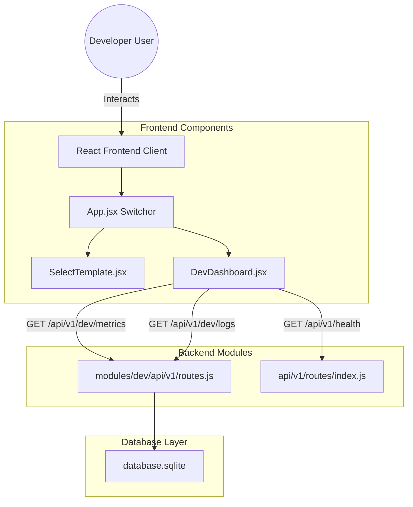
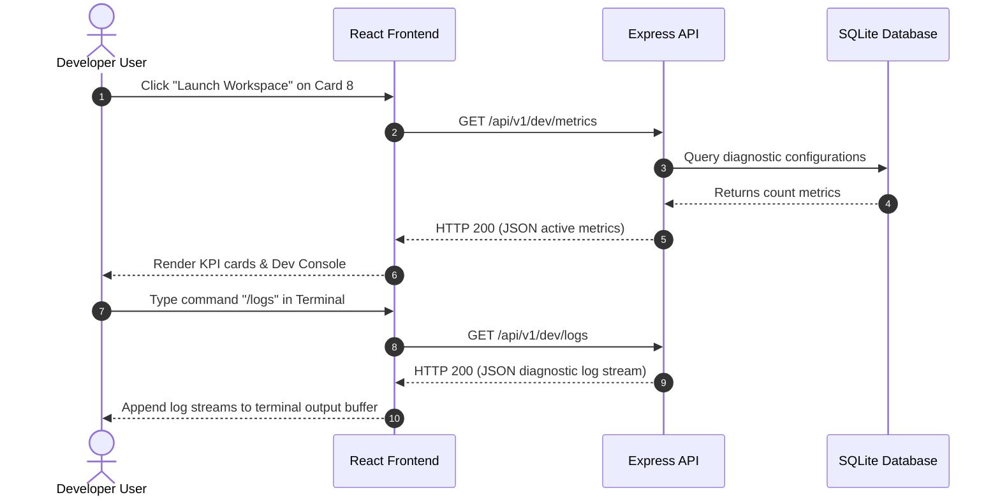

# Tech Architecture & Flow: Developer Dashboard

This document details the frontend and backend architectures and complete data workflows for the Developer Dashboard Workspace.

---

## 1. System Architecture

The feature integrates into the modular layout of our platform:

### Frontend Architecture
* **`SelectTemplate.jsx`**: Manages template card selection states. If the developer selects template card ID 8, a floating bar triggers a workspace launch sequence.
* **`DevDashboard.jsx`**: Keeps track of local metric counters and manages a command buffer array for terminal log stdout. A form intercepts submit events, matches regex commands, and appends output objects to the stream.

### Backend Architecture
* **Modular Router**: Mounted in `src/api/v1/routes/index.js` under the `/dev` path using node subpath imports.
* **Controller Handlers**: Resolves database parameters and builds JSON logs containing server events, process statuses, and environment variables.

---

## 2. Complete Working Flow

1. **Activation**: Developer enters the template gallery, selects the "Interactive Dev Showcase" template, and clicks "Launch Workspace".
2. **Boot**: `DevDashboard` fires a `useEffect` call targeting `/api/v1/dev/metrics` to request branch and ticket count states.
3. **Shell Initialization**: The terminal loads system logs and sets the input prompt.
4. **Command Loop**: When the user enters an interactive slash command:
   * `/status` / `/metrics`: Returns processed workspace settings.
   * `/logs`: Sends a fetch request to the backend log endpoint `/api/v1/dev/logs` and prints the output array directly into the console.
   * `/clear`: Flushes the stdout buffer array.
