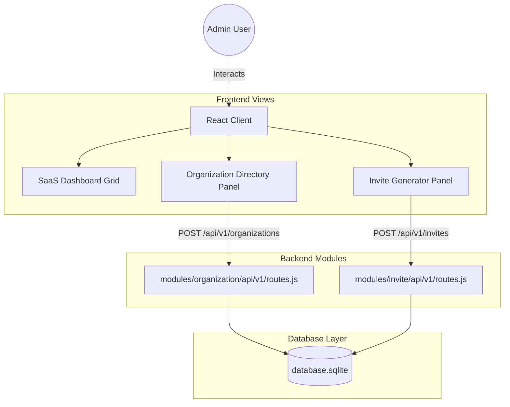
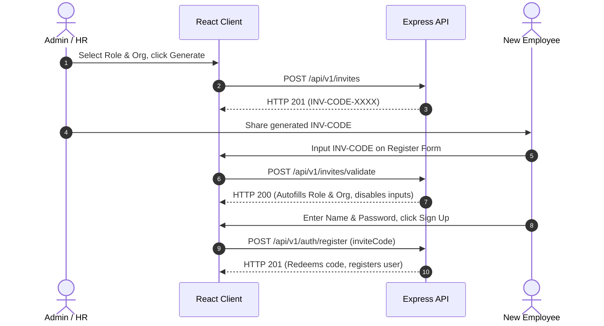

# Architecture & Flows: Organization and Invites

This document details the system architectures, interactions, and sequence diagrams for Day-1 features.

---

## 1. System Architecture

### Architectural Submodules
1. **Express Middlewares**: 
   * `authenticateToken`: Decodes JWT tokens.
   * `requireRole(['Admin', 'Super Admin'])`: Protects organization creation and invite generation routes.
2. **SQLite Database Helpers**:
   * Uses serialized runs to insert child nodes and register invitation states.

---

## 2. Complete Working Flow (Invite-Registration Pipeline)

1. **Generation**: Admin requests a new invite code with specific role/department constraints. Backend generates a unique random code and writes it to SQLite.
2. **Validation**: The prospective employee inputs this code on the registration page. Frontend makes an asynchronous validation call. If verified, role and organization selects are autofilled and locked.
3. **Consuming**: When signup completes, the user account is created and the invite token is marked as `redeemed` linked to the new user account ID.
